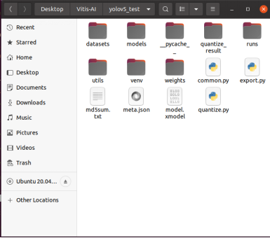
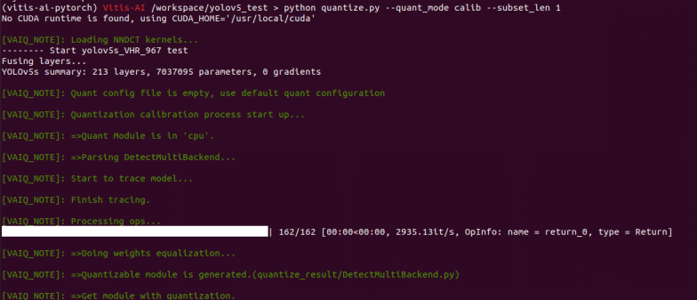
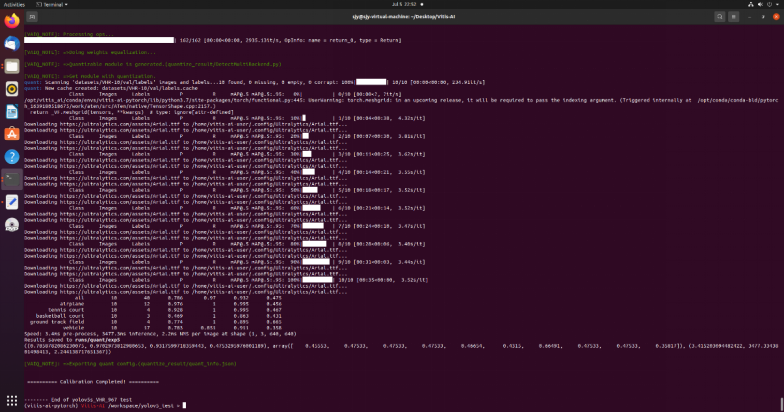
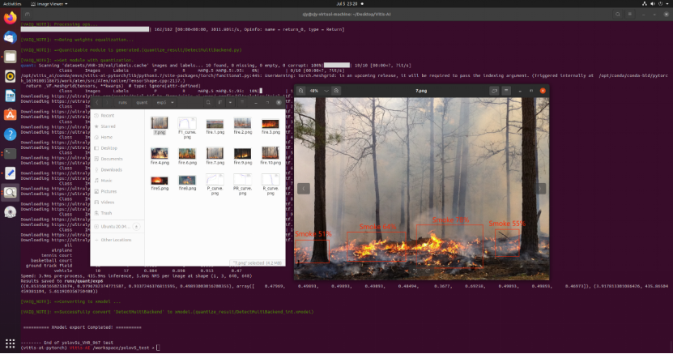

# Vitis ai zcu104 yolov5
Use Vitis AI to deploy yolov5 on ZCU104

<!-- ABOUT THE PROJECT -->
## About The Project
Use Vitis AI to deploy yolov5 on ZCU104

## 运行vai_q_pytorch

### 1）Prepare 3 files：

| name          | description                      |
| ------------- | -------------------------------- |
| model.pt      | pre-training model ,  PTH file   |
| model.py      | Python script                    |
| dataset       | 100 - 1000 images                |


### 2）modify model
要使 PyTorch 模型可量化，需要修改模型定义，以确保修改后的模型满足以下条件:
- 要量化的模型应仅含前传方法。所有其它函数都应移出或者迁移至派生的类。这些函数通常作为预处理和后处理来工作。如果不将其移出，那么此 API 会在量化模块中将其移除，这样会在前传量化模块时导致异常行为。 
- 这样浮点模型应可通过 jit 追踪测试。将浮点模块设置为评估状态，然后使用 torch.jit.trace 函数来测试浮点模型。
我们使用的yolov5模型，需要将特征提取中前传函数等多于部分去掉，修改后代码如下：
```
        z = []
        for i in range(nl):
            bs, _, ny, nx, _no= x[i].shape
            # x[i] = x[i].view(bs, na, no, ny, nx).permute(0, 1, 3, 4, 2).contiguous()
            if grid[i].shape[2:4] != x[i].shape[2:4]:
                    grid[i], anchor_grid[i] = _make_grid(anchors,stride,nx, ny, i)
```

### 3） vai_q_pytorch API 添加至浮点脚本
- 如果在量化前，已有经过训练的浮点模型和 Python 脚本用于对模型精度/mAP 进行求值，那么量化器 API 会将浮点模块替换为量化模块。常规求值函数鼓励量化模块前传。如果 quant_mode 标志设为“calib”，量化校准可在求值过 程中判定张量的量化步骤。校准后，将 quant_mode 设置为“test”以对量化模型进行求值。
 - 导入 vai_q_pytorch 模块
 ```
    from pytorch_nndct.apis import torch_quantizer, dump_xmodel
 ```

 - 以需要输入的量化模型来生成量化器，并获取转换后的模型。
 ```
   input = torch.randn([batch_size, 3, 224, 224])
   quantizer = torch_quantizer(quant_mode, model, (input))
   quant_model = quantizer.quant_model
 ```

 - 使用转换后的模型前传神经网络。

### 4）运行量化并获取结果
首先来看一下整体的文件目录结构。其中quantize.py即为量化脚本，数据集和label存放在datasets中，运行结果会生成在runs目录下。
](<Run Exm/文件夹层级目录.png>)

- 运行含“--quant_mode calib”的命令以量化模型。
```
python resnet18_quant.py --quant_mode calib --subset_len
```
](<Run Exm/calib.png>)

 - 此时量化开始，并且成功加载数据集和模型。并且量化后，开始对数据集中的模型进行预测。
](<Run Exm/calib_中间过程.png>)

 - 可以看到第一步calib运行完成，可以去runs文件夹中查看运行结果。
](<Run Exm/calib_final.png>)

 - 生成了量化后模型对数据集的预测，还有量化后模型的各项指标参数：F1、P、R、PR。


- 要生成 xmodel 进行编译（以及 onnx 格式量化模型），批次大小应为 1。设置 subset_len=1 可避免冗余迭代，并运行以下命令：
```
python resnet18_quant.py --quant_mode test --subset_len 1 --batch_size=1 --deploy
```


 - 同样，结果也会生成在runs文件夹下。


### 5） 生成可执行文件Xmodel
- 运行以下命令即可，需要注意的是要选择自己板卡所对应的DPU型号。
```
vai_c_xir -x ./quantize_result/DetectMultiBackend_int.xmodel -a /opt/vitis_ai/compiler/arch/DPUCZDX8G/ZCU104/arch.json -o ./ -n model
```
到生成了我们所需要的Xmodel可执行文件。

